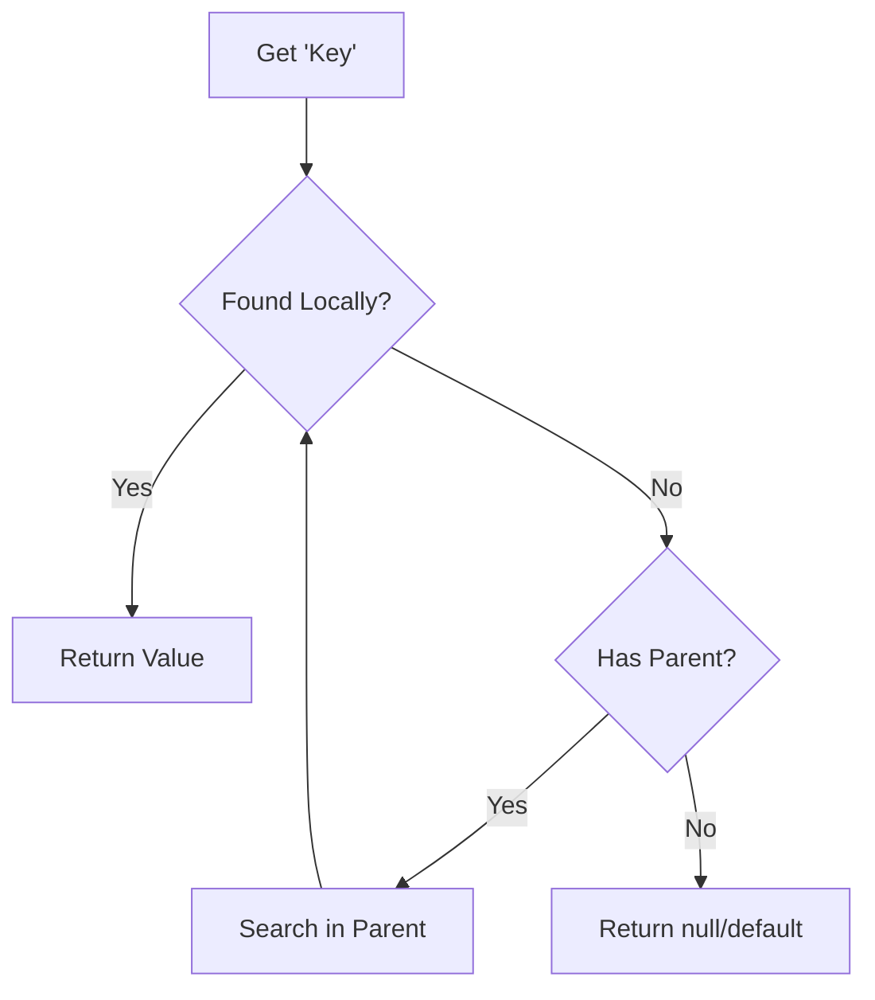
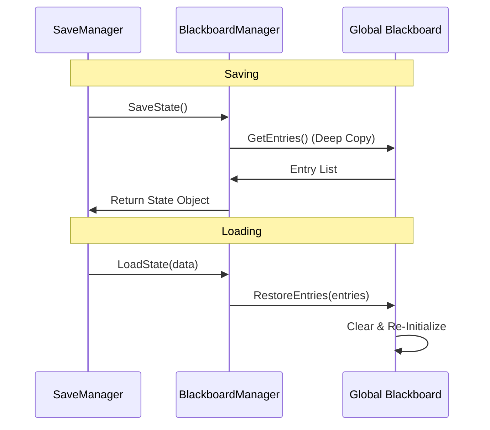

# Blackboard Service

The Blackboard is a hierarchy-aware shared data container. It allows different systems to share and override data in a decoupled way, supporting both global and localized scoping.

## Key Features

- **Hierarchical Scoping**: A blackboard can have a parent. If a key is not found locally, it recursively searches up the parent chain.
- **Thread-Safety**: Integrated with the Catalyst thread-safe runtime.
- **Persistence**: Fully integrated with the `SaveManager`. The **Global** blackboard is persisted automatically.
- **Type-Safe**: Provides generic `Set<T>` and `Get<T>` methods.
- **Reactive**: Support for general and key-specific change listeners via `OnValueChanged` and `RegisterListener`.

## Architecture

### Hierarchical Lookup
When a value is requested, the blackboard searches its local data. If not found, it delegates the request to its parent, continuing until a value is found or the root is reached.



### Persistence Flow
The `BlackboardManager` bridges the `Blackboard` system with the `SaveManager`.



## Usage

### Accessing the Global Blackboard

The global blackboard is managed by the `BlackboardManager` service.

```csharp
using Eraflo.Catalyst;
using Eraflo.Catalyst.Core.Blackboard;

// Get the global blackboard
var blackboard = App.Get<BlackboardManager>().Global;

// Set a value
blackboard.Set("Score", 100);

// Get a value
int score = blackboard.Get<int>("Score");
```

### Scoped Blackboards

You can create a "scoped" blackboard that inherits from the global one. This is useful for AI, localized states, or temporary contexts.

```csharp
var bm = App.Get<BlackboardManager>();
var scoped = bm.CreateScoped();

// This will find the value in the global blackboard if it exists there
int globalScore = scoped.Get<int>("Score");

// This only affects the scoped blackboard
scoped.Set("LocalTarget", someObject);
```

### Value Overriding

If you set a value in a scoped blackboard that already exists in the parent, the scoped value takes precedence for that blackboard and its children.

```csharp
global.Set("Gravity", 9.81f);
scoped.Set("Gravity", 1.62f); // Moon gravity for this context

float g = scoped.Get<float>("Gravity"); // Returns 1.62
```

### Change Listeners

#### Global Listener
```csharp
blackboard.OnValueChanged += (key, oldVal, newVal) => {
    Debug.Log($"Key {key} changed from {oldVal} to {newVal}");
};
```

#### Key-Specific Listener
```csharp
blackboard.RegisterListener("Score", (oldVal, newVal) => {
    UpdateScoreUI((int)newVal);
});
```

## Save System Integration

The `BlackboardManager` implements `ISaveable`. During a save operation, it captures all entries from the `Global` blackboard. These are restored automatically when the game state is loaded.

> [!IMPORTANT]
> To be persisted, values in the blackboard must be serializable by the `JsonSerializer`. Custom types may require specific converters if they are complex.

## Editor Integration

Catalyst provides a **Blackboard Panel** in the Behaviour Tree editor and a **Blackboard Runtime Viewer** in the `BehaviourTreeRunner` inspector. These allow you to monitor and modify blackboard values in real-time during Play Mode.
