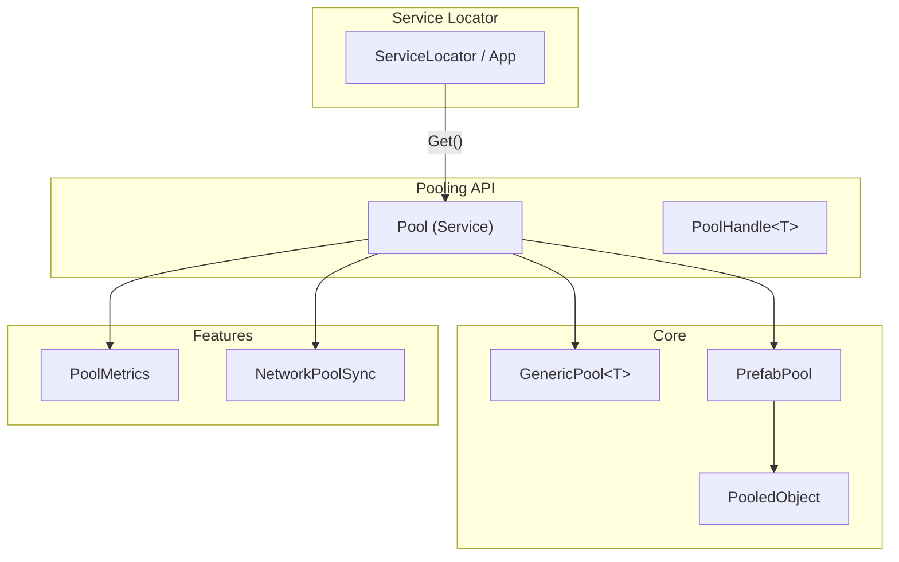

# Object Pooling System

A generic, thread-safe, async-safe, multiplayer-ready object pooling system.

## Quick Start

```csharp
using Eraflo.Catalyst.Pooling;

// 1. Get the service
var pool = App.Get<Pool>();

// Generic objects
var handle = pool.GetFromPool<Bullet>();
pool.ReleaseToPool(handle);

// Prefabs (GameObjects)
var vfx = pool.SpawnObject(explosionPrefab, transform.position);
pool.DespawnObject(vfx);

// Auto-despawn after 2 seconds
pool.SpawnObjectTimed(particlePrefab, pos, 2f);

// Pre-allocate for performance
pool.Warmup<Bullet>(100);
pool.WarmupObject(enemyPrefab, 20);
```

---

## Architecture



---

## Features

### Generic Pool (Any Class)

```csharp
var pool = App.Get<Pool>();

// Get from pool
var handle = pool.GetFromPool<MyClass>();
var instance = handle.Instance;

// Use the object...
instance.DoSomething();

// Return to pool
pool.ReleaseToPool(handle);
```

### Prefab Pool (GameObjects)

```csharp
var pool = App.Get<Pool>();

// Spawn prefab
var handle = pool.SpawnObject(prefab, position, rotation);

// Access the GameObject
handle.Instance.transform.LookAt(target);

// Despawn (return to pool)
pool.DespawnObject(handle);
```

### IPoolable Callbacks

```csharp
public class Bullet : MonoBehaviour, IPoolable
{
    public void OnSpawn()
    {
        // Reset state when spawned
        velocity = Vector3.zero;
        damage = 10;
    }

    public void OnDespawn()
    {
        // Cleanup when returned to pool
        trail.Clear();
    }
}
```

### Timer Integration

```csharp
// Auto-despawn after duration
App.Get<Pool>().SpawnObjectTimed(explosionPrefab, pos, 2f);

// PooledObject component also supports this:
pooledObject.DespawnAfter(3f);
```

### Warmup (Pre-allocation)

```csharp
// Generic pool warmup
var pool = App.Get<Pool>();
pool.Warmup<Bullet>(100);

// Prefab pool warmup
pool.WarmupObject(enemyPrefab, 20);
```

---

## Thread Safety

The pool system is thread-safe when `PackageRuntime.IsThreadSafe` is enabled.

```csharp
// Operations from any thread are safe
await Task.Run(() =>
{
    var pool = App.Get<Pool>();
    var handle = pool.GetFromPool<MyClass>();
    pool.ReleaseToPool(handle);
});
```

---

## Networking

Handlers are auto-registered via `PackageSettings`.

### Spawning (Server → Target)

```csharp
// SERVER: Spawn and broadcast to all clients (default)
var (handle, networkId) = PoolNetworkExtensions.SpawnNetworked(prefab, pos);

// SERVER: Spawn and broadcast to specific target
var (h, id) = PoolNetworkExtensions.SpawnNetworked(
    prefab, pos, Quaternion.identity,
    serverAuth: true,
    target: NetworkTarget.All  // or Others, Server, Clients
);

// LOCAL ONLY: Spawn without network broadcast (UI elements, etc.)
var localHandle = PoolNetworkExtensions.SpawnLocal(prefab, pos);
```

### Despawning (Server → Target)

```csharp
// SERVER: Despawn and notify all clients (default)
handle.DespawnNetworked();

// SERVER: Despawn with specific target
handle.DespawnNetworked(NetworkTarget.All);
```

### Manual Registration

```csharp
// SERVER: Register existing object for networking
var pool = App.Get<Pool>();
var handle = pool.SpawnObject(prefab, pos);
handle.RegisterNetworked();

// SERVER: Unregister when done
handle.UnregisterNetworked();
```

### Client Handling

```csharp
// CLIENT: React to spawn/despawn messages
var handler = App.Get<NetworkManager>().Handlers.Get<PoolNetworkHandler>();
handler.OnSpawnReceived += msg => { /* spawn locally */ };
handler.OnDespawnReceived += id => { /* despawn locally */ };
```

See [Networking.md](Networking.md) for details.

---

## Metrics

```csharp
var metrics = App.Get<Pool>().Metrics;

metrics.TotalSpawned;     // Total objects spawned
metrics.TotalDespawned;   // Total objects despawned
metrics.ActiveCount;      // Currently active
metrics.PeakActiveCount;  // Peak simultaneous active
```

---

## Editor Tools

### Pool Debugger Window

**Tools > Eraflo Catalyst > Pool Debugger**

Shows:
- List of all active pools
- Active/Available counts per pool
- Real-time metrics
- Clear pool buttons

### PooledObject Inspector

Shows:
- Current spawn state (Spawned/Pooled)
- Handle ID and Pool ID
- Time since spawn
- Quick Despawn buttons

---

## API Reference

### Pool

| Method | Description |
|--------|-------------|
| `GetFromPool<T>()` | Get object from generic pool |
| `ReleaseToPool<T>(handle)` | Return object to generic pool |
| `SpawnObject(prefab, pos, rot)` | Spawn prefab from pool |
| `SpawnObjectTimed(prefab, pos, duration)` | Spawn with auto-despawn |
| `DespawnObject(handle)` | Return prefab to pool |
| `Warmup<T>(count)` | Pre-allocate generic objects |
| `WarmupObject(prefab, count)` | Pre-allocate prefabs |
| `ClearFromPool<T>()` | Clear specific generic pool |
| `ClearObject(prefab)` | Clear specific prefab pool |
| `ClearAll()` | Clear all pools |

### PoolHandle<T>

| Property | Description |
|----------|-------------|
| `Id` | Unique handle ID |
| `Instance` | The pooled object |
| `PoolId` | Pool identifier |
| `SpawnTime` | Timestamp when spawned |
| `IsValid` | Whether handle is valid |

### PooledObject

| Property | Description |
|----------|-------------|
| `HandleId` | Current handle ID |
| `PoolId` | Pool identifier |
| `IsSpawned` | Whether currently spawned |
| `TimeSinceSpawn` | Seconds since spawn |
| `Despawn()` | Return to pool |
| `DespawnAfter(delay)` | Delayed despawn |

---

## File Structure

```
Runtime/Pooling/
├── Core/
│   ├── IPoolable.cs
│   ├── PoolHandle.cs
│   ├── GenericPool.cs
│   └── Pool.cs
├── Prefabs/
│   ├── PrefabPool.cs
│   └── PooledObject.cs
└── Features/
    ├── PoolMetrics.cs
    └── NetworkPoolSync.cs

Editor/Pooling/
├── PoolDebuggerWindow.cs
└── PooledObjectEditor.cs
```
