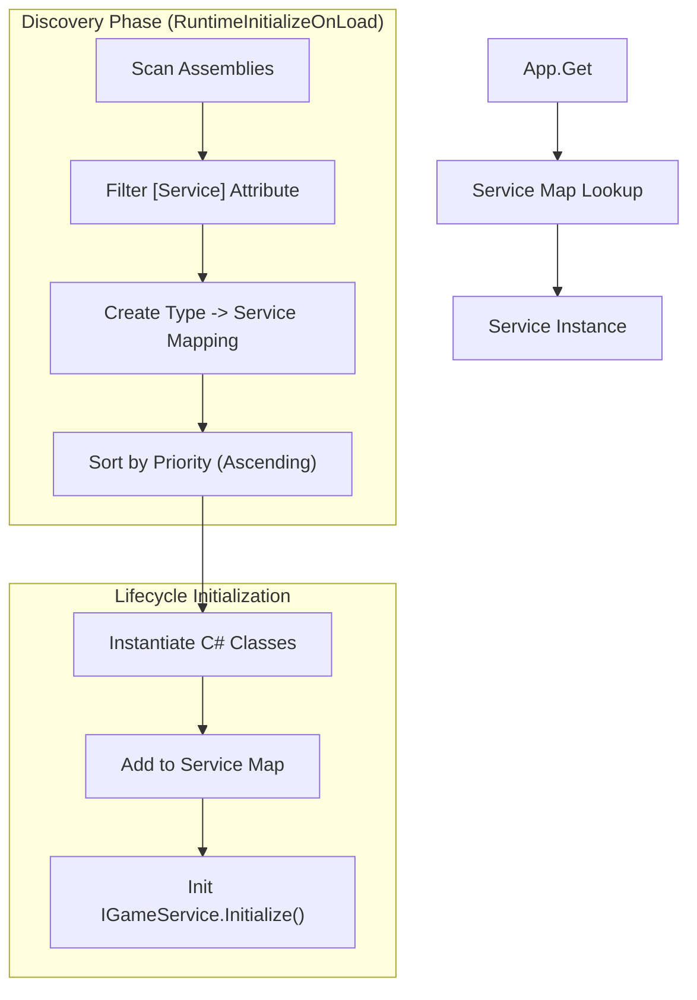
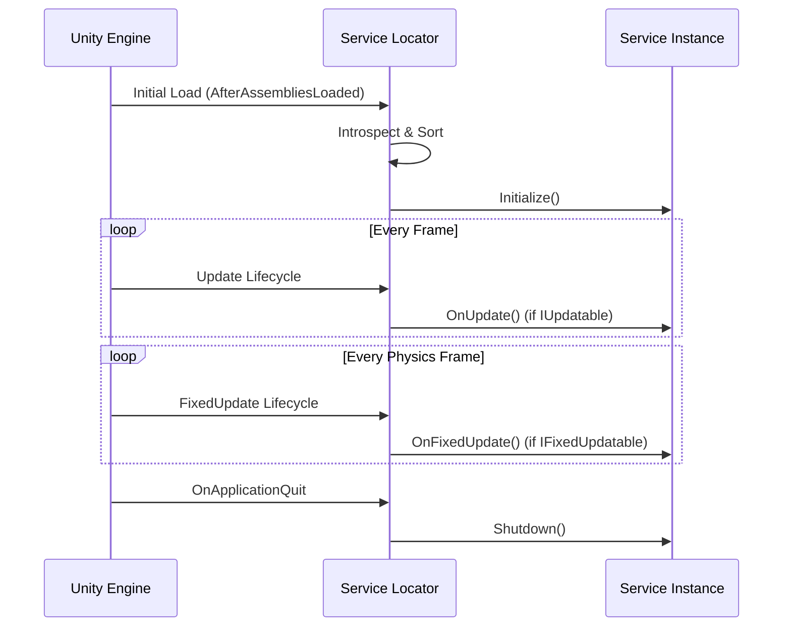

# Service Locator

The Service Locator (or Service Registry) is the architectural backbone of Eraflo.Catalyst. It provides a centralized, decoupled way to manage core systems (services) without relying on Singletons or MonoBehaviours.

## Key Features

- **Pure C# Services**: Services are POCO classes, reducing overhead and improving testability.
- **Auto-Discovery**: Mark any class with `[Service]` to have it automatically registered at startup.
- **Lifecycle Management**: Services can hook into Unity's update loop via `IUpdatable` and `IFixedUpdatable`.
- **Dependency Management**: Controlled initialization order via `Priority`.
- **Global Access**: Access any service from anywhere via the unified `App` facade.

### Architecture & Discovery

The initialization process uses Reflection to identify and configure services without manual registration.



## Usage

### Accessing a Service

Use `App.Get<T>()` to retrieve any registered service.

```csharp
using Eraflo.Catalyst.Services;
using Eraflo.Catalyst.Timers;

// Get the Timer service
var timer = App.Get<Timer>();
timer.CreateDelay(2f, () => Debug.Log("Delayed!"));

// Or use the static facade (backward compatibility)
Timer.Delay(2f, () => Debug.Log("Delayed!"));
```

### Creating a New Service

1.  **Define your class**: Implement `IGameService` (optional but recommended for initialization).
2.  **Add Lifecycle** (optional): Implement `IUpdatable` or `IFixedUpdatable`.
3.  **Attribute**: Mark with `[Service]`.

```csharp
using Eraflo.Catalyst.Services;
using Eraflo.Catalyst.Services.Attributes;
using UnityEngine;

[Service(Priority = 100)]
public class MyCustomService : IGameService, IUpdatable
{
    public void Initialize() 
    {
        Debug.Log("Service Initialized!");
    }

    public void OnUpdate() 
    {
        // Custom update logic
    }

    public void Shutdown() 
    {
        Debug.Log("Service Shutdown!");
    }
}
```

### Initialization Order

The `Priority` property in the `[Service]` attribute determines the order in which services are initialized and updated.
- **Lower Priority**: Initialized first, Updated first.
- **Higher Priority**: Initialized later, Updated later.

#### Architectural Layers

To maintain consistency, follow these priority brackets when adding new services:

| Priority Bracket | Layer | Description |
| :--- | :--- | :--- |
| **-100 to 0** | **Core** | Critical infrastructure (Events, Timers, Memory). |
| **1 to 20** | **Infrastructure** | Global data systems (Networking, Persistence, Pooling). |
| **21 to 50** | **Gameplay** | High-level game systems (AI, Combat, Quests). |
| **51 to 100+** | **Auxiliary** | Non-essential utilities, debug tools, and exporters. |

#### Current Package Priorities

| Service | Priority | Layer |
| :--- | :--- | :--- |
| `EventBus` | -10 | Core |
| `Timer` | 0 | Core |
| `BlackboardManager` | 5 | Core |
| `Pool` | 10 | Infrastructure |
| `SaveManager` | 10 | Infrastructure |
| `NetworkManager` | 20 | Infrastructure |
| `LogExporter` | 100 | Auxiliary |

## PlayerLoop Integration

The Service Locator automatically injects its lifecycle into Unity's `PlayerLoop`. You do **not** need to place any bootstrappers or MonoBehaviours in your scene for core systems to work. 

Initialization happens at `AfterAssembliesLoaded`, and updates are hooked into the `Update` and `FixedUpdate` system groups.



## Static Facades

For convenience, core modules like `Timer`, `Pool`, and `EventBus` provide static facades that internally call `App.Get<T>()`. This maintains a clean and familiar API while leveraging the robust service architecture.

```csharp
// Both are equivalent
Pool.Get<MyObject>();
App.Get<Pool>().Get<MyObject>();
```
