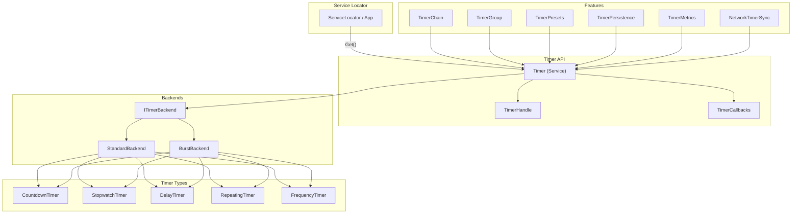

# Timer System

A high-performance, handle-based timer system with automatic backend selection and Burst support.

## Table of Contents
- [Quick Start](#quick-start)
- [Timer Types](#timer-types)
- [Callbacks](#extensible-callbacks)
- [Easing](#easing-integration)
- [Chaining & Groups](#timer-chaining)
- [Presets](#timer-presets)
- [Persistence](#timer-persistence)
- [Metrics](#timer-metrics)
- [Backends](#backends)
- [Multiplayer](#multiplayer-support)
- [API Reference](#api-reference)

---

## Architecture



---

## Quick Start

The Timer system is managed by the [Service Locator](ServiceLocator.md). Access it via `App.Get<Timer>()`.

```csharp
using Eraflo.Catalyst.Timers;

// 1. Get the service
var timer = App.Get<Timer>();

// 2. Create a delay
var handle = timer.CreateDelay(2f, () => Debug.Log("Done!"));

// 3. Subscription (using extension methods or TimerCallbacks)
TimerCallbacks.On<OnComplete>(handle, () => Debug.Log("Finished!"));

// 4. Control & Query
timer.Pause(handle);
float progress = timer.GetProgress(handle);
```

---

## Timer Types

| Type | Description | Callbacks |
|------|-------------|-----------|
| `CountdownTimer` | Counts down to 0 | OnComplete, OnTick, OnPause, OnResume, OnReset, OnCancel |
| `StopwatchTimer` | Counts up indefinitely | OnTick, OnPause, OnResume, OnReset, OnCancel |
| `DelayTimer` | One-shot countdown | OnComplete, OnTick, OnCancel |
| `RepeatingTimer` | Ticks every interval | OnComplete, OnRepeat, OnTick, OnPause, OnResume, OnReset, OnCancel |
| `FrequencyTimer` | N ticks per second | OnTick, OnPause, OnResume, OnReset, OnCancel |

---

## Extensible Callbacks

### Built-in

```csharp
var timer = App.Get<Timer>();
TimerCallbacks.On<OnComplete>(handle, () => { });           // Finished
TimerCallbacks.On<OnTick, float>(handle, (dt) => { });      // Every frame
TimerCallbacks.On<OnRepeat, int>(handle, (count) => { });   // Repeat interval
TimerCallbacks.On<OnPause>(handle, () => { });
TimerCallbacks.On<OnResume>(handle, () => { });
TimerCallbacks.On<OnReset>(handle, () => { });
TimerCallbacks.On<OnCancel>(handle, () => { });
```

### Custom

```csharp
// 1. Define callback type
public struct OnDamage : ITimerCallback { }

// 2. Implement in timer
public struct DamageTimer : ITimer, ISupportsCallback<OnDamage>
{
    public void CollectCallbacks(ICallbackCollector collector)
    {
        if (_shouldFire)
            collector.Trigger<OnDamage, DamageData>(_data);
    }
}

// 3. Use it
TimerCallbacks.On<OnDamage, DamageData>(handle, (data) => ApplyDamage(data));
```

---

## Easing Integration

```csharp
var timer = App.Get<Timer>();

// Eased progress
float eased = timer.GetEasedProgress(handle, EasingType.ElasticOut);

// Lerp (float, Vector2, Vector3, Quaternion, Color)
float value = timer.Lerp(handle, 0f, 100f, EasingType.QuadInOut);
Vector3 pos = timer.Lerp(handle, start, end, EasingType.BounceOut);
Color col = timer.Lerp(handle, Color.red, Color.blue, EasingType.Linear);

// Unclamped (for Elastic/Back overshoots)
float unclamped = timer.LerpUnclamped(handle, 0f, 10f, EasingType.ElasticOut);
```

---

## Timer Chaining

```csharp
App.Get<Timer>().Chain()
    .Delay(1f)
    .Then(() => Debug.Log("Step 1"))
    .Delay(2f)
    .Then(() => Debug.Log("Step 2"))
    .Loop(3, 0.5f, (i) => Debug.Log($"Loop {i}"))
    .Start();
```

## Timer Groups

```csharp
var group = App.Get<Timer>().CreateGroup("UI Timers");

var h1 = group.Create<CountdownTimer>(5f);
var h2 = group.Delay(3f, () => Debug.Log("Done"));

group.PauseAll();
group.ResumeAll();
group.SetTimeScaleAll(0.5f);
group.CancelAll();
```

---

## Timer Presets

Define reusable configurations:

```csharp
// Define (once at startup)
TimerPresets.Define("UIFade", 0.3f, EasingType.QuadOut);
TimerPresets.Define<RepeatingTimer>("Heartbeat", 1f);

// Use
var timer = App.Get<Timer>();
var handle = timer.CreateFromPreset("UIFade");
timer.CreateFromPreset("UIFade", () => OnComplete());
```

---

## Timer Persistence

Save/restore timers with callbacks:

```csharp
// Save
string json = TimerPersistence.SaveAll();
PlayerPrefs.SetString("Timers", json);

// Load (callbacks restored via reflection)
TimerPersistence.LoadAll(PlayerPrefs.GetString("Timers"));
```

> **Important**: Lambdas cannot be persisted. Use method references.

---

## Timer Metrics

```csharp
var m = App.Get<Timer>().Metrics;

m.TotalCreated       // Total timers created
m.ActiveCount        // Currently active
m.TotalCompleted     // Natural completions
m.TotalCancelled     // Cancellations
m.PeakActiveCount    // Max simultaneous
m.AverageDuration    // Average initial duration
m.LastUpdateMs       // Last update time (ms)

App.Get<Timer>().Metrics.Reset();
```

---

## Backends

### StandardBackend (Default)
Thread-safe, queue-based async operations.

### BurstBackend (High Performance)
Uses Unity.Burst + Unity.Collections for parallel updates.

Enable: **PackageSettings** → **Use Burst Timers**

---

## Multiplayer Support

Handlers are auto-registered via `PackageSettings`.

### Creating Networked Timers (Server)

```csharp
// SERVER: Create and register a networked timer
var timer = App.Get<Timer>();
var handle = timer.CreateTimer<CountdownTimer>(10f);
handle.MakeNetworked();  // Extension method
timer.Start(handle);
```

### Syncing State (Server → Clients)

```csharp
// SERVER: Periodically sync all networked timers to clients
void Update()
{
    if (NetworkManager.IsServer && Time.time > _nextSync)
    {
        TimerNetworkExtensions.BroadcastTimerSync();
        _nextSync = Time.time + 1f;
    }
}
```

### Cleanup

```csharp
// SERVER or CLIENT: Remove networking from a timer
handle.RemoveNetworking();  // Extension method
```

See [Networking.md](Networking.md) for details.

---

## API Reference

### Creation
| Method | Description |
|--------|-------------|
| `CreateTimer<T>(float)` | Create timer |
| `CreateDelay(float, Action)` | One-shot delay |
| `CreateFromPreset(string)` | Create from preset |

### Control
| Method | Description |
|--------|-------------|
| `Pause(handle)` | Pause |
| `Resume(handle)` | Resume |
| `Cancel(handle)` | Cancel and remove |
| `Reset(handle)` | Reset to initial |
| `SetTimeScale(handle, float)` | Time multiplier |
| `Clear()` | Remove all |

### Query
| Method | Description |
|--------|-------------|
| `GetProgress(handle)` | Progress 0-1 |
| `GetEasedProgress(handle, EasingType)` | Eased progress |
| `IsFinished(handle)` | Check finished |
| `IsRunning(handle)` | Check running |

### Events
| Method | Description |
|--------|-------------|
| `On<T>(handle, Action)` | Register callback |
| `On<T, TArg>(handle, Action<TArg>)` | With parameter |
| `Off<T>(handle)` | Unregister |

---

## File Structure

```
Runtime/Timers/
├── Core/           Timer.cs, TimerHandle.cs, ITimer.cs, TimerCallbacks.cs
├── Types/          CountdownTimer, StopwatchTimer, DelayTimer, etc.
├── Features/       TimerChain, TimerGroup, TimerPresets, TimerPersistence, TimerMetrics
├── Backends/       StandardBackend, BurstBackend
└── Debugging/      TimerDebugger (F5 overlay)
```
