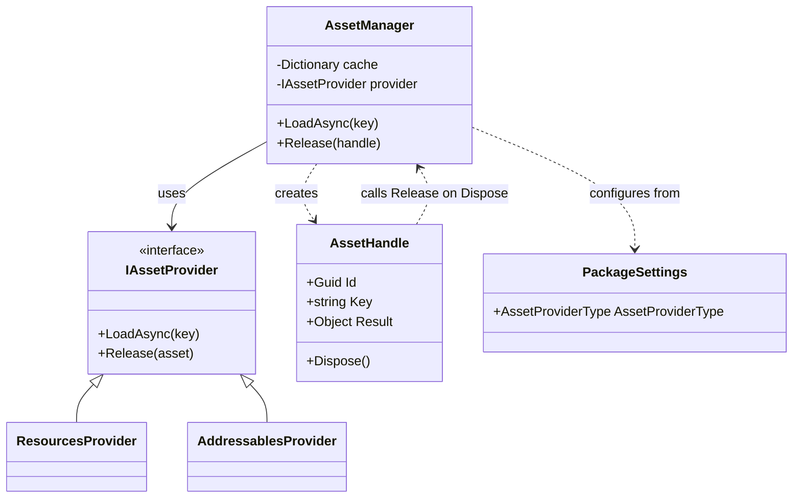
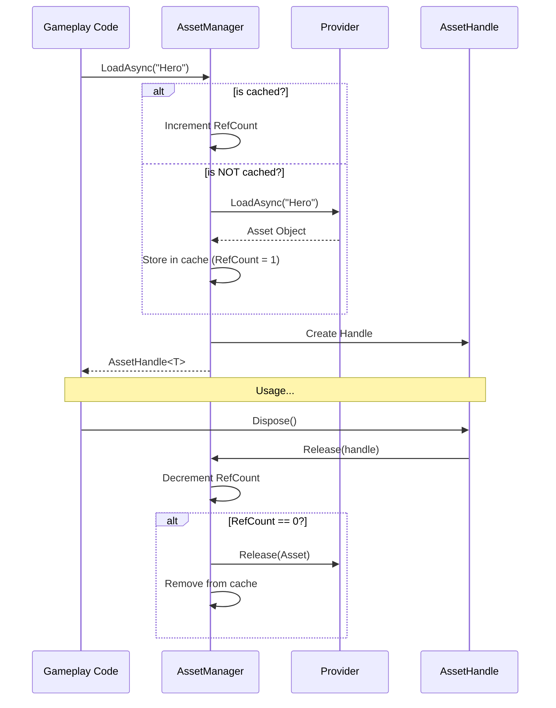

# Asset Management

The **Asset Management** module provides a clean abstraction for loading and managing Unity assets (Prefabs, Textures, Audio, etc.) with built-in reference counting and caching.

## Architecture



## Workflow: Loading an Asset



## Features

- **Abstraction:** Choose between `Resources` or `Addressables` without changing your gameplay code.
- **Reference Counting:** Automatically unloads assets when they are no longer used.
- **Caching:** Prevents redundant loading of the same asset key.
- **Disposable Handles:** Clean memory management using the `using` pattern.
- **Pool Integration:** Seamlessly load prefabs and prepare pools in a single call.

## Configuration

You can configure the default asset provider in the **Package Settings** (`CatalystSettings` in a Resources folder).

| Setting | Description |
| --- | --- |
| **Asset Provider Type** | Choose between `Resources` or `Addressables`. |

## Usage

### Basic Loading

```csharp
// Load a texture
var assetManager = App.Get<AssetManager>();
using (var handle = await assetManager.LoadAsync<Texture2D>("Backgrounds/Menu"))
{
    menuImage.texture = handle.Result;
    // ... do something ...
} // Asset reference is automatically decremented here
```

> [!TIP]
> Always use the `using` block or manually call `Dispose()` on the handle to ensure reference counting works correctly.

### Loading and Pooling

The module includes an extension for the `Pool` system to load a prefab and warm up its pool simultaneously.

```csharp
var pool = App.Get<Pool>();
// Loads "VFX/Explosion" and instantiates 10 instances in the pool
var handle = await pool.LoadAndPoolAsync("VFX/Explosion", 10);

// Later, spawn from pool as usual
var explosion = pool.SpawnObject(handle.Result, position);
```

## Custom Providers

You can implement your own provider by creating a class that implements `IAssetProvider`:

```csharp
public interface IAssetProvider
{
    Task<T> LoadAsync<T>(string key) where T : Object;
    void Release(Object asset);
}
```

Then, set it at runtime:
```csharp
App.Get<AssetManager>().SetProvider(new MyCustomProvider());
```

## Performance Note

- **Resources:** Good for small projects or legacy assets.
- **Addressables:** Recommended for larger projects, DLC, and better memory management.
- **Caching:** The `AssetManager` keeps a `TaskCompletionSource` for pending loads, ensuring that multiple simultaneous requests for the same key don't trigger multiple disk reads.
