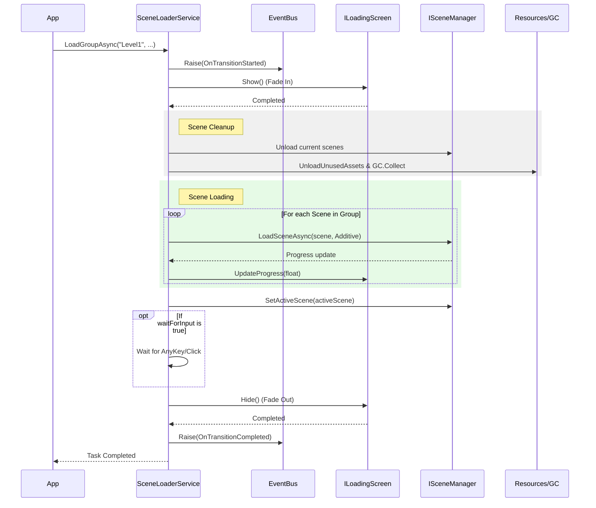
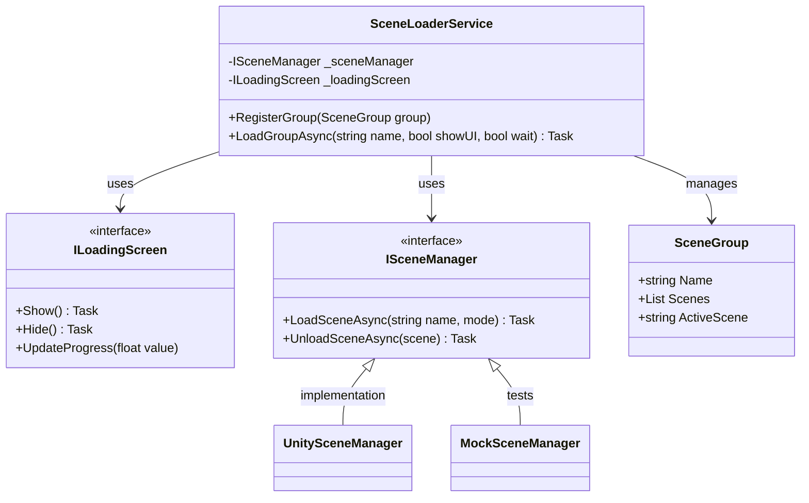

# Scene Flow Manager

The **Scene Flow Manager** is a robust system for handling complex scene transitions in Unity. It supports additive scene groups, automated loading screen management, memory cleanup, and transition events.

## Features

- **Scene Groups**: Define sets of scenes that belong together (e.g., Level 1 + HUD + Persistent UI).
- **Automated Flow**: Orchestrates the entire transition: Events -> Fade In -> Unload -> GC -> Load -> Set Active -> Fade Out.
- **UI Abstraction**: Seamlessly integrates with any loading screen UI via the `ILoadingScreen` interface.
- **Memory Management**: Automatically calls `Resources.UnloadUnusedAssets()` and `GC.Collect()` between loads to prevent fragmentation and memory spikes.
- **Testable Architecture**: Uses an abstracted `ISceneManager` to allow unit testing of scene flows without physical scene assets.

## The Transition Flow

The following diagram illustrates the sequence of operations during a scene transition:



## How to Use

### 1. Registering Scene Groups

You can define and register scene groups during your initialization phase:

```csharp
var group = new SceneGroup {
    Name = "Level_Desert",
    Scenes = new List<string> { "Environment_Desert", "UI_HUD", "Gameplay_Core" },
    ActiveScene = "Gameplay_Core"
};

App.Get<SceneLoaderService>().RegisterGroup(group);
```

### 2. Triggering a Load

To transition to a group:

```csharp
// Simple load
await App.Get<SceneLoaderService>().LoadGroupAsync("Level_Desert");

// Load with "Press any key to continue"
await App.Get<SceneLoaderService>().LoadGroupAsync("Level_Desert", waitForInput: true);
```

### 3. Implementing a Loading Screen

Simply implement the `ILoadingScreen` interface on a MonoBehaviour:

```csharp
public class MyLoadingUI : MonoBehaviour, ILoadingScreen {
    public CanvasGroup fadeGroup;
    public Image progressBar;

    public void Initialize() { /* Register yourself or setup */ }
    public void Shutdown() { }

    public async Task Show() {
        await fadeGroup.DOFade(1, 0.5f).AsyncWaitForCompletion();
    }

    public async Task Hide() {
        await fadeGroup.DOFade(0, 0.5f).AsyncWaitForCompletion();
    }

    public void UpdateProgress(float value) {
        progressBar.fillAmount = value;
    }
}
```

## Architecture

The system is built on a decoupled architecture to ensure testability and flexibility.


