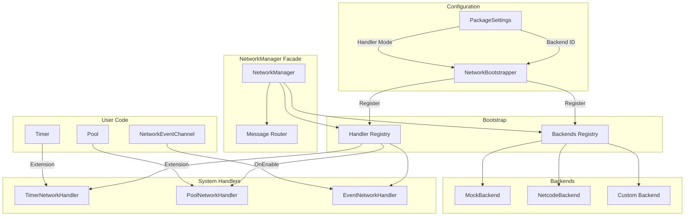

# Networking System

Unified, extensible networking abstraction with auto-registration.

## Architecture



## Quick Start

Everything is automatic! Configure in `PackageSettings` and use:

```csharp
// Timers
var handle = Timer.Create<CountdownTimer>(10f);
handle.MakeNetworked();
Timer.Start(handle);
TimerNetworkExtensions.BroadcastTimerSync();

// Pool - with target selection
var (h, id) = PoolNetworkExtensions.SpawnNetworked(prefab, pos, Quaternion.identity, true, NetworkTarget.Clients);
h.DespawnNetworked(NetworkTarget.All);

// Local-only spawn (no network broadcast)
var localHandle = PoolNetworkExtensions.SpawnLocal(prefab, pos);

// Events - with target selection
myNetworkChannel.Raise();                    // Use default target
myNetworkChannel.Raise(NetworkTarget.Server); // Send to server only
myNetworkChannel.RaiseLocal();               // Local only
```

---

## Configuration

### PackageSettings

| Setting | Values | Description |
|---------|--------|-------------|
| **Backend ID** | `mock`, `netcode`, custom | Which backend to use |
| **Handler Mode** | `Auto`, `Manual` | Handler registration |
| **Debug Mode** | bool | Network logs |

---

## NetworkTarget

```csharp
public enum NetworkTarget
{
    All,      // Server + all clients
    Others,   // Everyone except sender
    Server,   // Server only
    Clients   // All clients only
}
```

---

## Extension Methods

### Timer

```csharp
// SERVER: Create and network a timer
var handle = Timer.Create<CountdownTimer>(5f);
handle.MakeNetworked();
Timer.Start(handle);

// SERVER: Sync all timers to clients
TimerNetworkExtensions.BroadcastTimerSync();

// Cleanup
handle.RemoveNetworking();
handle.GetNetworkId();
```

### Pool

```csharp
// SERVER: Spawn with target
var (h, id) = PoolNetworkExtensions.SpawnNetworked(
    prefab, pos, Quaternion.identity,
    serverAuth: true,
    target: NetworkTarget.Clients  // or All, Others, Server
);

// LOCAL ONLY: Spawn without broadcast (e.g., UI elements)
var localHandle = PoolNetworkExtensions.SpawnLocal(prefab, pos);

// Despawn with target
handle.DespawnNetworked(NetworkTarget.All);

// Manual registration
handle.RegisterNetworked();
handle.UnregisterNetworked();
handle.GetNetworkId();
```

### Events

```csharp
// Use default target from inspector
myNetworkChannel.Raise();

// Override target at runtime
myNetworkChannel.Raise(NetworkTarget.Server);
myNetworkChannel.Raise(NetworkTarget.Others);

// Local only
myNetworkChannel.RaiseLocal();
```

---

## Custom Backend

```csharp
public class MyBackend : INetworkBackend
{
    public bool IsServer => ...;
    public bool IsClient => ...;
    public bool IsConnected => ...;
    
    public void Initialize() { }
    public void Shutdown() { }
    public void Send(ushort msgType, byte[] data, NetworkTarget target) { }
    public void RegisterHandler(ushort msgType, Action<byte[], ulong> h) { }
    public void UnregisterHandler(ushort msgType) { }
}

public class MyFactory : INetworkBackendFactory
{
    public string Id => "mybackend";
    public string DisplayName => "My Backend";
    public bool IsAvailable => true;
    public bool OnInitialize() => NetworkManager.SetBackendById(Id);
    public INetworkBackend Create() => new MyBackend();
}
```

---

## Custom Message

```csharp
public struct MyMessage : INetworkMessage
{
    public int Data;
    
    public void Serialize(BinaryWriter w) => w.Write(Data);
    public void Deserialize(BinaryReader r) => Data = r.ReadInt32();
}

NetworkManager.Send(new MyMessage { Data = 42 }, NetworkTarget.All);
NetworkManager.On<MyMessage>(msg => Debug.Log(msg.Data));
```

---

## File Structure

```
Runtime/Networking/
├── Core/            NetworkManager, NetworkSerializer
├── Registries/      BackendRegistry, MessageRouter, HandlerRegistry
├── Bootstrap/       NetworkBootstrapper
├── Backends/
│   ├── Mock/
│   └── Netcode/
└── Messages/

Runtime/Timers/Features/   TimerNetworkHandler, Extensions
Runtime/Pooling/Features/  PoolNetworkHandler, Extensions
Runtime/Events/Network/    EventNetworkHandler, NetworkEventChannel
```
