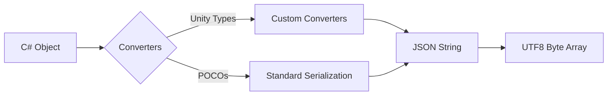
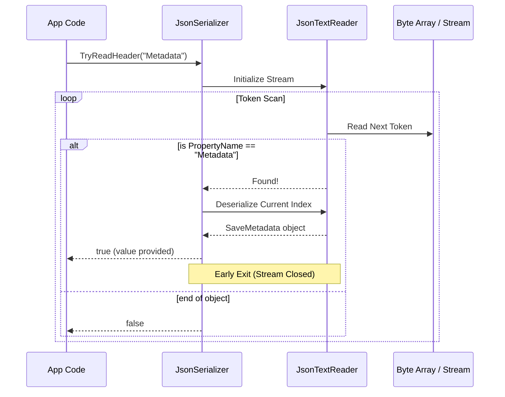

# Serialization System

The Catalyst serialization system provides a unified, high-performance way to convert between C# objects and raw data (byte arrays). It is designed to handle Unity-specific types and support optimized partial deserialization.

## ISerializer Interface

The contract for all serializers in the framework:

```csharp
public interface ISerializer
{
    byte[] Serialize<T>(T obj);
    T Deserialize<T>(byte[] data);
    void Populate(byte[] data, object target);
    bool TryReadHeader<T>(byte[] data, string fieldName, out T value);
}
```

### Serialization Flow



## JsonSerializer

The default implementation uses `Newtonsoft.Json` (Json.NET) and is optimized for Unity development.

### Unity Type Support
Standard JSON serializers often struggle with Unity types like `Vector3`, `Quaternion`, and `Color` because they contain internal fields or circular references. Catalyst's `JsonSerializer` includes custom converters for:
- `Vector2` / `Vector3` / `Vector4`
- `Quaternion`
- `Color` / `Color32`

### Optimized Header Reading (`TryReadHeader`)
For performance-critical operations (like reading save metadata without loading the entire state), the `JsonSerializer` supports **Partial Deserialization**.

It uses a `JsonTextReader` to scan the JSON stream and only deserialize the requested field, stopping as soon as it's found.



```csharp
// Fast metadata recovery
if (serializer.TryReadHeader<SaveMetadata>(saveData, "Metadata", out var meta))
{
    Debug.Log($"Loading save: {meta.Name}");
}
```

## Adding Custom Converters

You can extend the `JsonSerializer` by adding custom `JsonConverter` implementations to handles specialized types or third-party classes.

## Usage in Persistence

The `SaveManager` uses `ISerializer` to handle game state. You can swap the default `JsonSerializer` for a binary or compressed serializer by setting the `Serializer` property on the `SaveManager` service.

```csharp
App.Get<SaveManager>().Serializer = new MyCustomBinarySerializer();
```
